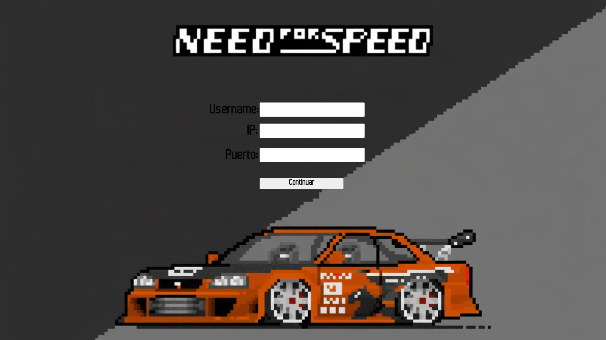
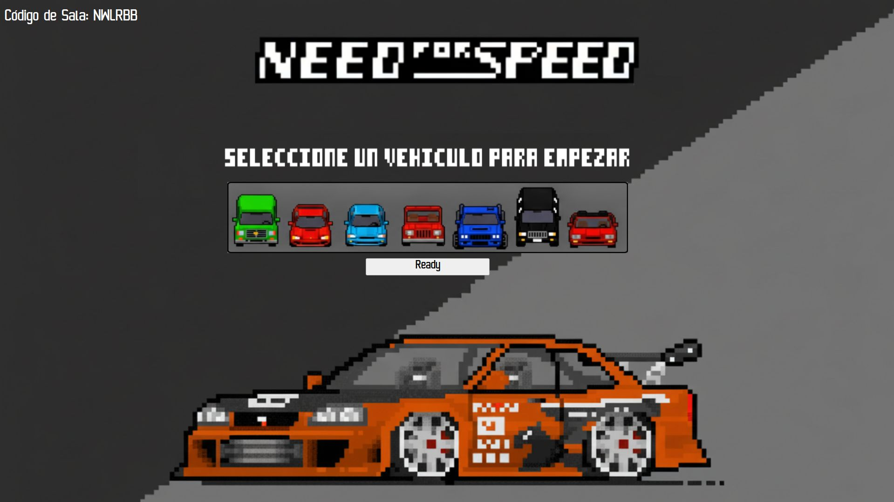
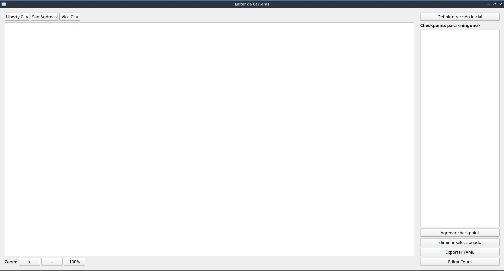

# TP_grupal_taller_G26

#### [Enlace al Trailer del juego](https://youtu.be/mLHopa-LgVM)

## Requisitos del sistema
- Ubuntu 24.04 LTS

# Instalación

```bash
sudo bash install.sh
```

**El instalador automático:**

- Descarga e instala todas las dependencias (SDL2, Qt5, yaml-cpp, etc)
- Ejecuta los tests
- Compila el proyecto completo
- Instala binarios en `/usr/bin/`
- Instala assets en `/var/nfs2d/`

**Nota:** El instalador requiere permisos de administrador para instalar en el sistema.


# Desinstalación

```bash
sudo bash uninstall.sh
```

**El desinstalador automático:**

- Elimina binarios en `/usr/bin/`
- Elimina assets en `/var/nfs2d/`

**Nota:** El desinstalador requiere permisos de administrador.


# Guía de Usuario

## Servidor


Para ejecutar el servidor:

```bash
nfs2d_server <puerto>
```

**Para cerrar el servidor:**

- Presionar `q`


### Cliente

Para ejecutar el cliente:

```bash
nfs2d_client
```

#### Unirse al servidor

Debés eligir un nombre de usuario e indicar la IP y puerto del servidor al que te quieras unir.



#### Unirse/Crear Lobby

Podés crear un nuevo Lobby o unirte a uno ya existente. 


#### Crear Partida

Al crear una partida tendrás que seleccionar el tour que desees jugar de los disponibles.


##### Selección del Auto

Tanto al unirte como al crear tendrás que seleccionar el auto con el que desees jugar y luego presionar "Ready".



##### Listo para jugar

En esta pantalla deberás esperar que todos tus amigos se unan a tu partida mediante el **Código de Sala**. Una vez todos los jugadores en la sala hayan clickeado "Listo para empezar!" la partida comienza.


#### Controles del juego

| Acción | Descripción |
|--------|-------------|
| **↑↓← →** | Movimiento |
| **M** | Ocultar/Mostrar minimapa |
| **T** | (entre carreras) Resultados parciales/acumulados |
| **Esc** / **q** | Salir |

## Explicación de Juego

### Carrera
La carrera consta de uno o más circuitos en los que todos los jugadores compiten en simultáneo, atravesando las zonas del mapa marcadas como checkpoints en el orden establecido hasta llegar a la línea de meta. Cada circuito finaliza cuando todos los jugadores la cruzan o en su defecto quedan destruidos, o cuando se alcanza el límite de tiempo de diez (10) minutos. Luego se muestra el tiempo registrado por cada uno y el acumulado correspondiente a todos los circuitos. Una vez completados todos los circuitos, la carrera concluye y resultando ganador el jugador con el menor tiempo total acumulado.

### Auto
El usuario tiene la posibilidad de elegir entre una variedad de autos. Cada vehículo tiene distintas estadísticas, influyendo en su control y forma de manejo. A su vez, cada auto cuenta con una salud inicial la cual disminuye cuando se produce un choque. La fuerza del choque determina la cantidad de vida que es disminuida.

- **Modificaciones:**
Cada vez que se finaliza un circuito el usuario tiene la posibilidad de mejorar algunas de las estadísticas de su auto (velocidad, aceleración, controlabilidad, salud). Cada mejora tiene un costo que se computa como una penalización del tiempo de llegada de la siguiente carrera.

## Editor de Carreras

Para ejecutar el editor:

```bash
nfs2d_editor
```

Al iniciar el editor verás la siguiente interfaz:




Deberás elegir en la esquina superior izquierda para qué mapa deseas crear una carrera. Luego tendrás que colocar los checkpoints deseados (al menos uno) haciendo click en "Agregar Checkpoint" y luego sobre la imagen mantén presionado el botón izquierdo del mouse y arrastra para dibujar un rectángulo. Luego seleccioná la dirección en la que quieras que los autos aparezcan. Y finalmente presioná "Exportar YAML".

#### Funcionalidades del Editor

| Acción | Descripción |
|--------|-------------|
| **ruedita** | Scroll vertical |
| **shift + ruedita** | Scroll horizontal |
| **Ctrl + ruedita** | Zoom in/out en la grilla |


# Créditos

### Grupo 26

- [Ulises Valentín Tripaldi](https://github.com/utripaldi)
- [Máximo Augusto Calderón Vasil](https://github.com/maxivasil)
- [Bautista Canepa](https://github.com/ManteCvK)
- [Maximo Giovanettoni](https://github.com/maximogiovanettoni)

### Corrector

- [Martín Di Paola](https://github.com/eldipa)

### Librerías Utilizadas

- **[Librería de sockets](https://github.com/eldipa/sockets-en-cpp)** (GPL v2)
- **[Librería de Thread](https://github.com/eldipa/hands-on-threads)** (GPL v2)
- **[Librería de Queue](https://github.com/eldipa/hands-on-threads)** (GPL v2)
- **[Box2d](https://github.com/erincatto/box2d.git)** (MIT license)

