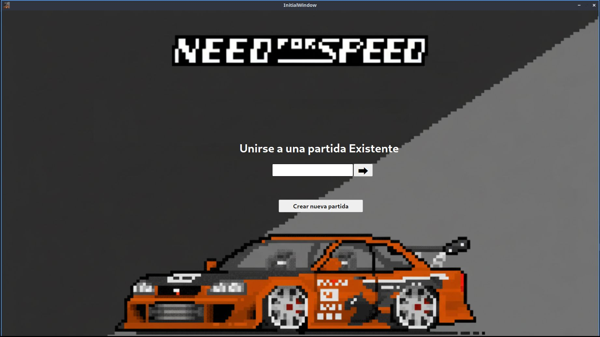
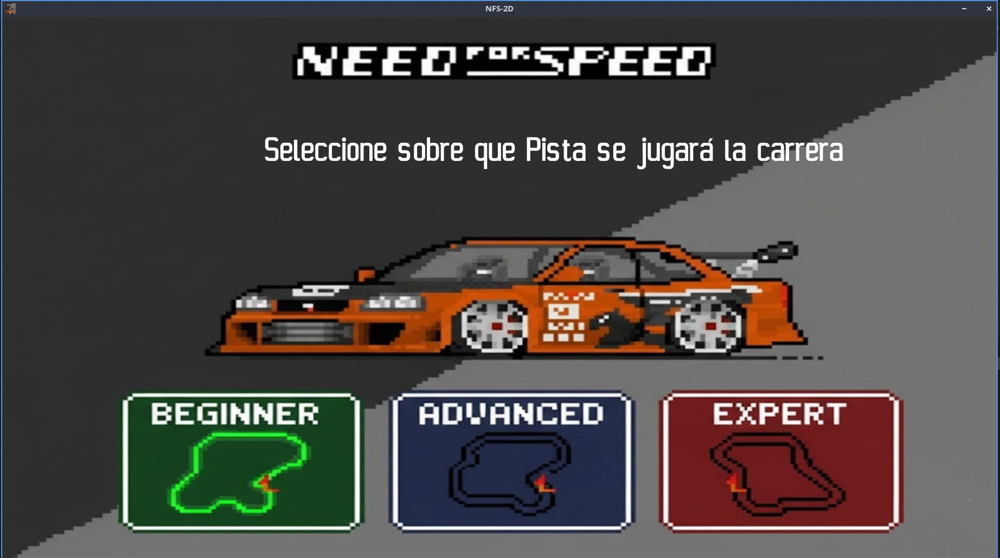
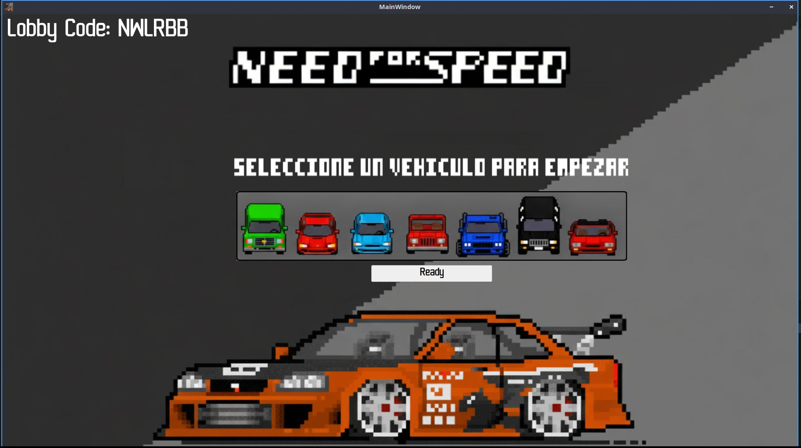
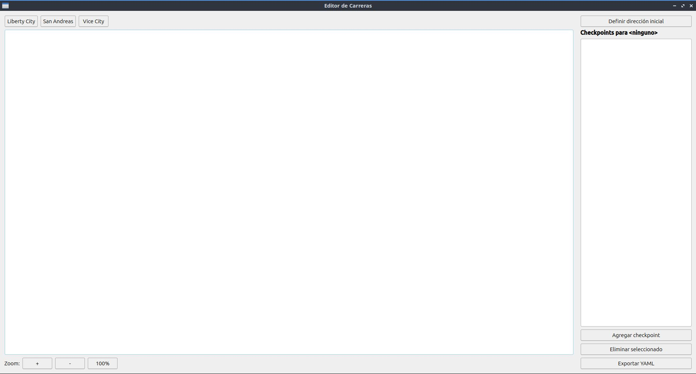

# TP_grupal_taller_G26


## Instalación

```bash
sudo bash install.sh
```

**El instalador automático:**

- Descarga e instala todas las dependencias (SDL2, Qt5, yaml-cpp)
- Compila el proyecto completo
- Instala binarios en `/usr/bin/`
- Instala assets en `/var/nfs2d/`

**Nota:** El instalador requiere permisos de administrador para instalar en el sistema.


## Desinstalación

```bash
sudo bash uninstall.sh
```

**El desinstalador automático:**

- Elimina binarios en `/usr/bin/`
- Elimina assets en `/var/nfs2d/`

**Nota:** El desinstalador requiere permisos de administrador.


## Guía de Usuario

### Servidor

Para ejecutar el servidor:

```bash
./build/nfs2d_server <puerto>
```

**Para cerrar el servidor:**

- Presionar `q`


### Cliente

Para ejecutar el cliente:

```bash
./build/nfs2d_client <IP> <puerto>
```

#### Unirse/Crear Lobby

Podés crear un nuevo Lobby o unirte a uno ya existente. 




#### Crear Partida

Al crear una partida tendrás que selecionar el tour que desees jugar de los disponibles.




##### Selección del Auto

Tanto al unirte como al crear tendrás que seleccionar el auto con el que desees jugar y luego presionar "Ready".
Una vez todos los jugadores en el Lobby estén "Ready" la partidad comienza.




#### Controles del juego

| Acción | Descripción |
|--------|-------------|
| **↑↓← →** | Movimiento |
| **M** | Ocultar/Mostar minimapa |
| **T** | (entre carreras) Resultados parciales/acumulados |
| **Esc** / **q** | Salir |


### Editor de Carreras

Para ejecutar el editor:

```bash
./build/nfs2d_editor
```

Al iniciar el editor verás la siguiente interfaz:




Deberás elegir en la esquina sumerior izquierda para qué mapa deseas crear una carrera. Luego tendrás que colocar los checkpoints deseados (al menos uno) haciendo click en "Agregar Checkpoin" y luego sobre la imagen mantén presionado el botón izquierdo del mouse y arrastra para dibujar un rectángulo. Luego seleccioná la dirección en la que quieras que los autos aparezcan. Y finalmente presioná "Exportar YAML".

#### Funcionalidades del Editor

| Acción | Descripción |
|--------|-------------|
| **ruedita** | Scroll vertical |
| **shift + ruedita** | Scroll horizontal |
| **Ctrl + ruedita** | Zoom in/out en la grilla |


## Créditos

### Grupo 26

- [Ulises Valentín Tripaldi](https://github.com/utripaldi)
- [Máximo Augusto Calderón Vasil](https://github.com/maxivasil)
- [Bautista Canepa](https://github.com/ManteCvK)
- [Maximo Giovanettoni](https://github.com/maximogiovanettoni)

### Corrector

- [Martín Di Paola](https://github.com/eldipa)

### Librerías Utilizadas

- **[Librería de sockets](https://github.com/eldipa/sockets-en-cpp)** (GPL v2)
- **[Librería de Thread](https://github.com/eldipa/hands-on-threads)** (GPL v2)
- **[Librería de Queue](https://github.com/eldipa/hands-on-threads)** (GPL v2)
- **[Box2d](https://github.com/erincatto/box2d.git)** (MIT license)

